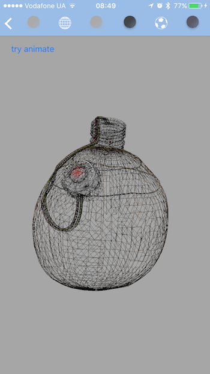
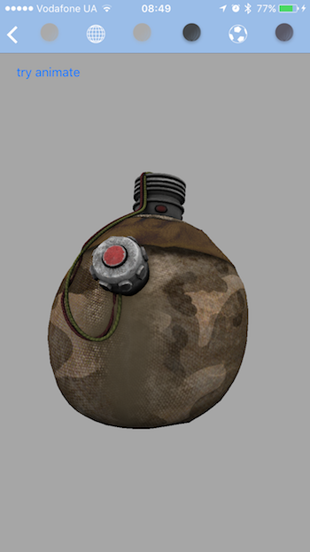

#fbx2opengles

This is simple project for importing fbx files to opengles2.0 on iPhone using Autodesk SDK without Unity.

**It's still in progress...**

###### Features
* read fbx file and convert to Objective-C++
* read info about animation (stacks, layers, curves)
* texturing
* read complex fbx files
* possibility to control object (move, rotate, scale etc)

###### TODO:

* read bones as separate obj and display them
* apply animations and display it

**If u want to help - just create new pull request :)**

##### Usefull Links 

* [Animation structure Autodesk SDK](http://help.autodesk.com/view/FBX/2016/ENU/?guid=__files_GUID_E8A5224C_488F_4477_AFE1_FC1EDB6934CB_htm)
* [ImportScene](https://github.com/cyrillef/FBX-iOS-ImportScene)

##### Links described problems

* [Reading animations](http://stackoverflow.com/q/38951625/2012219) - **SOLVED**
* [Parse file](http://stackoverflow.com/q/38825708/2012219) - **SOLVED**
* [Projections](http://stackoverflow.com/q/39267880/2012219) - **WORKAROUND**
* [Animation](http://stackoverflow.com/q/40073465/2012219) - ACTIVE

##### Samples (for current version)

